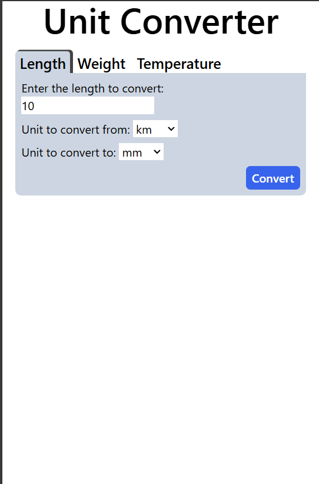
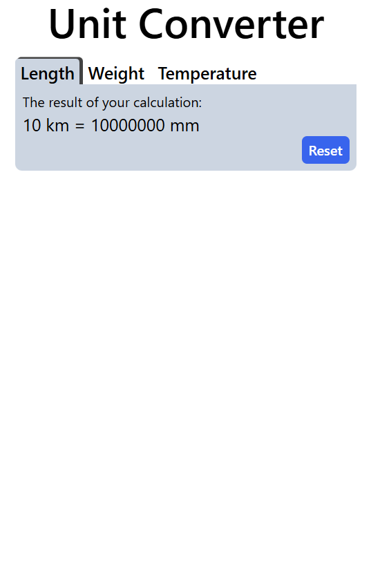

# Roadmap-Unit-Converter

## Description
The Unit Converter Web Application is a versatile, user-friendly tool designed to convert measurements between various units across different categories, including length, weight, and temperature. It is built using Go, the Gin framework, and HTMX.

It is inspired by the [Unit Converter](https://roadmap.sh/projects/unit-converter) project from [roadmap.sh](https://roadmap.sh/).

## Installation
1. **Clone the Repository**: Clone the project from GitHub to your local machine.

```bash
git clone https://github.com/TuanLe53/Roadmap-Unit-Converter.git
```

2. **Change into the project directory**: Navigate into the project's directory.
```bash
cd Roadmap-Unit-Converter
```

3. **Install the dependencies**: Download and install the necessary dependencies specified in the go.mod file.
```bash
go mod download
```

4. **Run the Go Project**: Compile and run the project.
```bash
go run .
```

5. **Build the Go Project (Optional)**: Compile the project into an executable.
```bash
go build
```

6. **Run the server**: Start the server using the executable.
```bash
/unit-converter
```

Access the Application: Open your web browser and go to http://localhost:8080 to use the application.

## Screenshots
<p float="left">
    
    
</p>